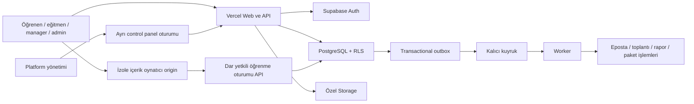

# SaaS mimarisi, veri ve güvenlik

> v1.0 baz çizgisi, 21 Eylül 2026. Nihai teknik seçim ve faz sınırları için [08 — Final kararlar](08-final-kararlar.md), uygulama sözleşmeleri için 09–14 geçerlidir.

Durum: önerilen mimari. Altyapı hesabı açılmadı, bağlantı kurulmadı ve uygulama kodu yazılmadı. Ürün/SDK sürümleri uygulama başlangıcında destek durumu kontrol edilerek lockfile ile sabitlenecek.

## 1. Yapı

Modüler monolit: TypeScript + Next.js/React web uygulaması, Vercel dağıtımı, Supabase PostgreSQL/Auth/Storage/Realtime, GitHub kaynak ve CI. Tek kod tabanı; LMS, LXP, authoring, destek, marka, entegrasyon ve raporlama alanları servis arayüzleriyle ayrılır. Erken mikroservis yükü oluşturulmaz.

Uzun işler için Supabase Queues üzerinde kalıcı iş kaydı ve ayrı container worker kullanılır. Worker hedefi Google Cloud Run Jobs europe-west3 olarak seçildi; sınırlar 08 belgesindedir. Vercel web uygulaması temel dağıtım hedefidir; video dönüştürme ve büyük ZIP açma web isteğinin içine yerleştirilmez.

Önerilen repo düzeni: `apps/web`, `apps/worker`, `packages/domain`, `packages/ui`, `packages/contracts`, `packages/learning-runtime`, `supabase/migrations`, `supabase/tests`, `tests/e2e`, `docs`, `assets`. Control panel ayrı Vercel projesi/host ve oturum kapsamıyla aynı ortak paketleri kullanabilir. Gerçek ayrımı ilk tehdit modelinde doğrulanacak.

## 2. Tenant, portal ve sektör

- Tenant müşteri/veri sınırıdır. B1'de tenant başına bir portal; veri modeli daha sonra bir tenantın birden fazla portal sunmasına izin verir. Portal, tenantın marka/erişim yüzüdür.
- Sektör tenantın veritabanı değildir. `industry_pack` sürümlü terminoloji, başlangıç rolleri, beceriler, program şablonları ve asset referanslarını sağlar.
- `tenant_id` değişmez UUID; sektör/portal slug'ı URL içindir. URL değiştirmek kullanıcı/sertifika/rapor kimliğini değiştirmez.
- İstek yolu `/avukat/oguzlawacademy` sunucuda kayıtlı portal UUID'sine çözülür. `tenant_id` body/header değeri güven kaynağı değildir. Yol ile oturum üyeliği birlikte doğrulanır.
- Aynı email'in iki kurumdaki üyelikleri ayrı kayıttır. Kurum değiştirince sorgu, cache, realtime ve yükleme bağlamı da değişir.
- Hazır sektör güncellemesi müşterinin düzenlediği şablonu ezmez; değişiklik karşılaştırması ve seçmeli uygulama vardır.
- Sektör eklemek yeni müşteri kod dalı, ayrı tablo ailesi veya kopyalanmış uygulama gerektirmez.
- Demo: sentetik içerik/veri, görünür demo etiketi, eposta gönderim kısıtı, deneme süresi, güvenli sıfırlama. Tam sürüme geçişte demo kayıtlarını tut/sil açık seçimi; canlı öğrenme kayıtları silinmez.

## 3. Yetkilendirme ve izolasyon

Kimlik Supabase Auth'ta; aktif üyelik, izin ve ekip kapsamı uygulama verisinde. JWT'deki rol tek başına yeterli değildir; üyelik iptali kritik işlemlerde anında kontrol edilir. Sunucu oturum çerezleri güvenli, HttpOnly ve uygun SameSite ayarıyla kullanılır; CSRF/Origin kontrolleri mutasyonlarda uygulanır.

Tenant tablolarında `tenant_id NOT NULL`, uygun birleşik index ve `(tenant_id, id)` benzersizliği; tenantlar arası ilişkiyi engelleyen bileşik foreign key. Bütün exposed tablo/view/RPC/storage/realtime erişimlerinde aynı sınır. RLS ve SQL grant birlikte değerlendirilir. Kritik not/sertifika/puan yazımı yalnızca doğrulayan işlem üzerinden olur. [Supabase RLS](https://supabase.com/docs/guides/database/postgres/row-level-security)

Platform rolleri son kullanıcı profil alanından atanamaz. Service role yalnızca sunucu/worker'da ve sınırlı yönetim yolunda; kullanıcı isteğini genel service-role CRUD'a dönüştürmek yasaktır. Worker işi güvenilir kayıttaki tenant ve işlem türüyle çalışır; ham kullanıcı payload'ı yetki oluşturmaz.

Her liste/indirme/arama/dışa aktarım için yetki kontrolü; “ID tahmin edilemez” güvenlik sayılmaz. Kurum bazlı sorgu cache anahtarı üyelik ve yetki bağlamını içerir; kişisel yanıtlar ortak CDN cache'e girmez. Arama ve AI vektör retrieval da aynı izin filtresine tabidir.

Dosyalar özel bucket'ta tenant/source/version yoluyla saklanır. URL üretmeden erişim denetlenir; kısa ömürlü imzalı URL yeniden paylaşılırsa ömrü boyunca erişilebilir olabileceği kabul edilir. Kayıt iptalinin derhal uygulanması gereken kaynaklar proxy/yeniden yetkilendirilen teslim yolundan sunulur. [Storage güvenliği](https://supabase.com/docs/guides/storage/security/access-control)

Super admin tüm destek taleplerinin operasyonel durumunu görebilir. Mesaj/ek/öğrenen bağlamına erişim ayrı destek izni, gerekçe ve audit gerektirir. Kullanıcı adına işlem yapma B1'de yok; sonraki sürümde açık banner, süre sınırı, read-only varsayılan ve eylem bazlı kısıtlama.

## 4. Mantıksal veri modeli

Bu tablo fiziksel migration değildir; alan sahipliği ve ilişkilerin temel sözleşmesidir. Veri sözlüğünde alan tipi/nullable/index/retention ayrıntıları kodlama öncesi tamamlanır.

| Alan | Ana varlıklar | Önemli ilişki / değişmez kural |
|---|---|---|
| Platform | tenants, portals, industry_packs, pack_versions, subscriptions, entitlements, quotas | Portal tenant'a; lisans kurum ve ürün modülüne bağlı |
| Kimlik | profiles, memberships, roles, permissions, role_assignments, invitations, identity_providers | Kimlik global; üyelik ve rol tenant kapsamında |
| Organizasyon | org_units, groups, group_members, manager_assignments | Dönemli ekip ilişkisi; döngü ve self-manager engeli |
| Marka | brand_versions, theme_tokens, banners, template_instances | Taslak/yayın; tenant override, kaynak paket sürümü |
| İçerik | courses, course_versions, learning_objects, assets, asset_versions, licenses | Yayınlanmış sürüm immutable; asset lisansı tenant erişimini sınırlar |
| Program | programs, program_versions, steps, prerequisites, equivalencies | Döngüsüz bağımlılık; atama belirli sürüme bağlı |
| Öğrenme | assignments, enrollments, attempts, learning_sessions, progress_snapshots, completion_records | Birden fazla deneme; güncel özet ile ham kanıt ayrı |
| Değerlendirme | question_banks, question_versions, assessment_versions, responses, grades, rubrics | Yanıt sorunun sürümüne bağlı; doğru cevap istemciye önceden gönderilmez |
| Etkinlik | events, sessions, registrations, attendance_intervals, attendance_decisions | Sağlayıcı dış kimliği + occurrence; birleştirilmiş süre |
| Uyumluluk | requirement_versions, applicability_rules, obligation_cycles, exemptions, evidence | Bir gereksinimin her yenileme dönemi ayrı; hukuki kaynak/sorumlu |
| Beceri | competencies, role_profiles, target_levels, skill_claims, validations | Öz beyan ve onay farklı; kanıtın süresi/iptali yansır |
| Sertifika | certificate_templates, template_versions, issued_certificates, external_credentials | Verilen belge şablon ve kazanım anını saklar; iptal kaydı |
| Oyun | point_rules, point_ledger, badges, badge_awards, challenges | Append-only puan defteri; kaynak olay + kural benzersiz |
| LXP/sosyal | interests, saved_items, feeds, posts, comments, communities, memberships, moderation_cases | Kurum/kitle filtresi; silme ve moderasyon görünürlüğü |
| İletişim | threads, messages, notifications, preferences, template_versions, delivery_attempts | Sohbet ile destek iç notu farklı görünürlük alanları |
| Otomasyon | workflow_versions, workflow_runs, action_runs, schedules | Tekil tetikleyici; kural döngüsü sınırı; tekrar güvenliği |
| Rapor | report_definitions, report_runs, export_assets, report_schedules | Çalıştırma anında yetki yeniden doğrulanır |
| Destek | tickets, ticket_messages, escalations, assignments, sla_events, support_access_grants | Açık mesaj / kurum iç notu / platform iç notu ayrı |
| Authoring | projects, draft_revisions, blocks, publish_jobs, artifacts | LMS sürümü ile yayın artifact'ı hash üzerinden eşleşir |
| İçerik operasyonu | training_needs, production_tasks, readiness_items, review_cycles, suppliers | Hazırlık, lisans ve öğrenme ilerlemesi ayrı |
| Altyapı | integrations, webhook_inbox, outbox_events, jobs, audit_events, consent_records | Secret referansları; idempotency ve trace ID |

Tüm tenant iş kayıtlarında oluşturma/güncelleme zamanı UTC, işlemi yapan kimlik ve gerekli yerlerde sürüm sayacı bulunur. Soft delete her yerde varsayılan değildir: kaynak yaşam döngüsü ile KVKK kapsamında silme/anonymization ayrı operasyonlardır.

## 5. Durum makineleri

- Portal: `provisioning → demo|active → suspended → archived → deletion_pending → deleted`. Askıya alma içerik silmez; rapor/retention erişimleri sözleşmeye göre ayrılır.
- İçerik: `draft → in_review → approved → published → retired`. Yayınlı sürüm değişmez; düzeltme yeni sürüm yaratır.
- Atama: `scheduled → active → completed|cancelled|exempted`. `overdue` son tarih ve duruma göre türetilir, tamamlanmayla birlikte tarihsel gecikme bilgisi korunur.
- Deneme: `created → in_progress → submitted → graded`. Tamamlanma ve geçme ayrı sonuçlar; bağlantı kopması failed sayılmaz.
- Dış sertifika: `submitted → under_review → approved|rejected → expired|revoked`.
- Yayın işi: `queued → validating → building → verifying → published|failed`. Başarısız iş mevcut yayını değiştirmez.
- Ticket: `open → in_progress → waiting_requester|waiting_platform → resolved → closed`; yeniden açılabilir. Aktarım sahipliği ve görünürlüğü ayrıca izlenir.

## 6. İşlem ve olay sözleşmesi

Atama oluşturma, publish, sertifika üretme, CSV import, webhook ve puan üretme idempotent olmalıdır. Tek transaction içinde iş kaydı + outbox yazılır; kuyruk teslimi en az bir kez varsayılır. Consumer tekrar çalışsa bile aynı sonuç ikinci kez üretilmez. Kuyruk özelliği tek başına dış epostanın “tam bir kez” gönderildiği garantisi değildir.

Ortak olay zarfı: `event_id`, `event_type`, `schema_version`, `tenant_id`, `actor_id`, `subject_id`, `occurred_at`, `received_at`, `source`, `correlation_id`, `idempotency_key`, `payload`. Kullanıcı/tenant kimliği istemcinin iddiasından değil doğrulanmış bağlamdan alınır.

Örnek zincir: geçerli deneme sonucu → completion transaction → `learning.completed` → bağımsız sertifika/XP/bildirim/rapor tüketicileri. Sertifika worker'ı geçici hata verirse eğitim tamamlanması geri alınmaz; belge “hazırlanıyor” gösterilir, tekrar denenir.

Retry: üstel gecikme + jitter, iş türüne özel üst sınır, kalıcı hatada dead-letter ve operatör yeniden çalıştırma. Ham payload loglanmaz; correlation ID ile teşhis edilir. Eski tamamlanma olayı yeni kurs sürümünü tamamlamaz.

## 7. API taslağı

İç web API'si `/api/v1`; tenant context server resolver ile; tutarlı hata gövdesi `{code, message, field_errors, trace_id}`. Listeleme cursor pagination ve izinli sort/filter. Uzun iş `202 + job_id`, iş durumu endpoint'i. İstemci mutasyonlarında idempotency key ve değiştirilebilir taslaklarda optimistic version.

| İşlem ailesi | Örnek arayüz | Temel kontrol |
|---|---|---|
| Portal | `POST /platform/tenants`, `POST /platform/tenants/:id/provision` | Platform izni, slug çakışması, tekrar güvenli kurulum |
| Üyeler | `POST /members/imports`, `POST /invitations` | Kolon önizlemesi, satır bazlı hata, mevcut üyelik |
| İçerik | `POST /courses/:id/versions`, `POST /course-versions/:id/publish` | Editör/yayın izni, onay/lisans/asset kapıları |
| Atama | `POST /assignments/preview`, `POST /assignments` | Etkilenen kişi önizlemesi, atomik kayıt ve bildirim |
| Oynatıcı | `POST /learning/launch`, `POST /learning/sessions/:id/events` | Üye, enrollment, sürüm ve session kapsamlı token |
| Sonuç | `POST /attempts/:id/submit`, `POST /attempts/:id/grade` | Tekrar/deneme limiti, sunucu puanlama, instructor kapsamı |
| Rapor | `POST /reports/runs`, `GET /jobs/:id` | Yetkili veri kümesi, kaynak limiti, export TTL |
| Authoring | `POST /authoring/projects/:id/publish` | Entitlement, revision kilidi, artifact doğrulama |
| Destek | `POST /tickets`, `POST /tickets/:id/escalations` | Ticket görünürlüğü, eklerin erişimi, aktarım gerekçesi |
| Sağlayıcı | `POST /webhooks/:provider` | Sağlayıcıya uygun imza/doğrulama, replay ve tenant eşlemesi |

Genel müşteri API anahtarları ve webhook abonelikleri G fazında; internal API herkese açık entegrasyon taahhüdü değildir.

## 8. Güvenlik ve gizlilik gereksinimleri

- Admin ve platform yetkilerinde MFA; rate limit, login deneme kontrolü, davet süre sonu, erişim iptali ve oturum sonlandırma.
- Zengin metin sanitize; HTML/script serbestliği yok. Logo SVG yüklemesi sanitize/rasterize edilmeden yayınlanmaz. Harici URL'den sunucu fetch işlemlerinde SSRF/private IP koruması.
- ZIP: path traversal/symlink/bomb sınırı, dosya sayısı/çıkartılmış boyut sınırı, zararlı içerik taraması, karantina. SCORM paketi güvenilir sayılmaz.
- Gizli dosyalar indirilebilir bağlantılarla yanlışlıkla kamusallaşmaz; sertifika doğrulama sayfası minimum bilgi ve tahmin edilemeyen token kullanır.
- OAuth refresh token/SMTP sırları vault/secret manager'da; UI'da maskeli, audit/log/export dışında. Tenant başına bağlantı; iptal/rotation destekli.
- İşlem denetimi: aktör, tenant, işlem, kaynak, önce/sonra özet, gerekçe, zaman, trace. Parola, token ve gereksiz cevap metni kaydedilmez.
- Audit uygulama rollerine append-only; veritabanı yöneticisine karşı mutlak değiştirilemezlik iddia edilmez. G fazında bağımsız değiştirilemez arşiv değerlendirilir.
- AI'ya varsayılan olarak gerçek dava/müvekkil belgesi gönderilmez. Kişisel veri minimizasyonu, sağlayıcı sözleşmesi ve müşteri tercihi veri akışına uygulanır.

KVKK ilk giriş deneyimi, veri işleme sebebi, rıza ve aydınlatma ayrı kayıtlarla tasarlanır. Yurt dışı aktarım, saklama süreleri, veri sorumlusu/işleyen rolleri müşteri hukuk incelemesiyle kapanır; tek checkbox hukuki uyum sağlamaz. [Aydınlatma](https://www.kvkk.gov.tr/Icerik/4132/aydinlatma-yukumlulugunun-yerine-getirilmesinde-uyulacak-usul-ve-esaslar-hakkinda-teblig), [aktarım](https://www.kvkk.gov.tr/Icerik/2053/Yurtdisina-Aktarim).

## 9. İşletim ve ölçek

- Ayrı local/test/staging/production; preview deployment üretim verisine/sırlarına bağlanmaz. Sentetik test seed'i.
- GitHub PR: tip, lint, migration/RLS, domain testleri, kritik E2E, dependency/secret taraması. Main dağıtımı kontrollü; veri migration'ı expand-contract; geri dönüş yalnızca önceki UI deploy değildir.
- Raporlar ağır ham olay sorguları yerine tenant kapsamlı özetlerden; olaya bağlı güncelleme ve periyodik uzlaştırma. Supabase Realtime yalnızca izinli kanal; dashboard trafiği 30–60 sn güncellenebilir, “anlık” gecikmesi gösterilir.
- Gözlemlenebilirlik: API hata/gecikme, kuyruk yaşı, bildirim teslimi, entegrasyon sağlığı, öğrenme kayıt gecikmesi, depolama/egress ve tenant başına tüketim.
- Pilot performans hedefleri, yük testiyle doğrulanmak üzere: 100 eşzamanlı oturum; normal API p95 <800 ms; ana ekran LCP p75 <2,5 sn, INP <200 ms, CLS <0,1. Büyük export asenkron; medya yükleme süresi ayrı izlenir.
- Yedek: DB ile dosya/object sürümleri ayrı korunur. Önerilen pilot hedefi RPO ≤24 saat ve RTO ≤8 saat; sağlayıcı planı ve restore tatbikatı olmadan garanti edilmez. Daha sıkı hedef için PITR ve maliyet kararı gerekir.
- Saklama politikası tamamlanmadan otomatik eğitim/sertifika silme açılmaz. Geçici export için öneri 7 gün; teşhis logları 30 gün; destek ve kanıt kayıtları sözleşme/hukuk kararına bağlı.
- Tenant kapatma: export → sözleşmesel bekleme → izinlerin iptali → planlı silme/anonymization → yedek yaşlanması kaydı. Başka tenanttaki aynı kişinin üyeliği etkilenmez.
