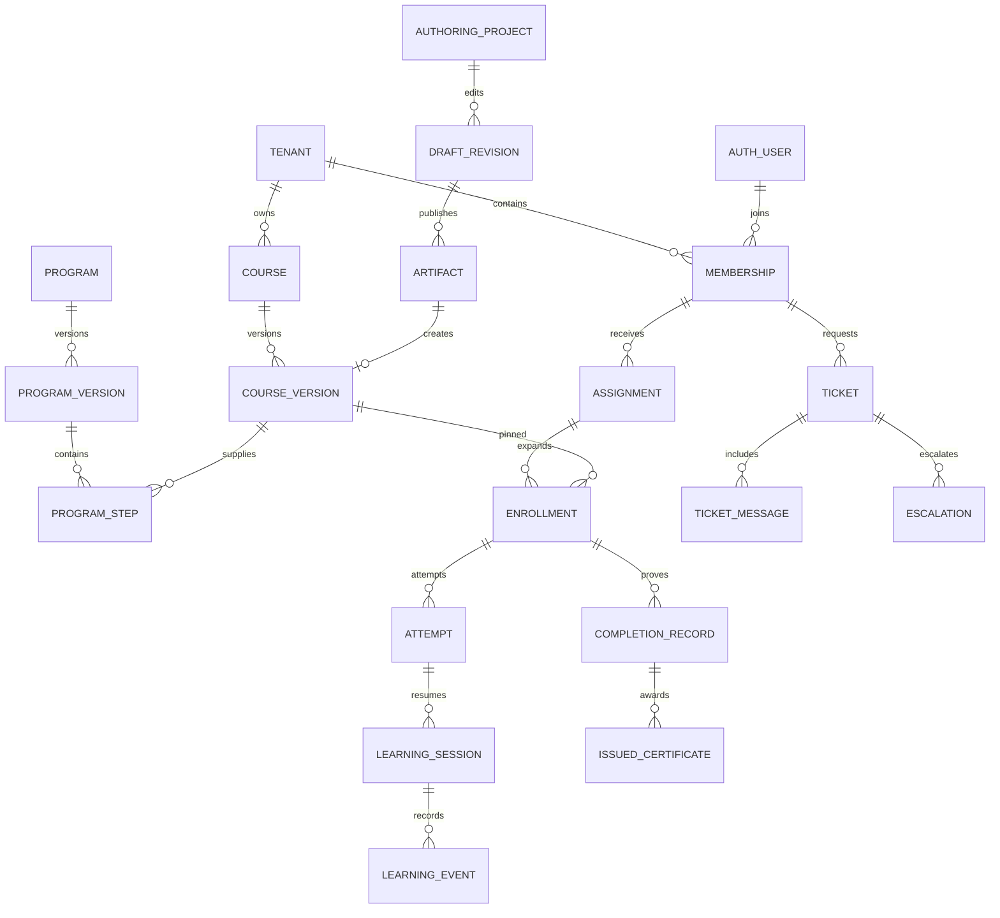

# Veri sözleşmesi v1.0

Bu bir migration değil, uygulayıcının üreteceği schema'nın sözleşmesidir. Aşağıda isim verilen alanlar ve kısıtlar normatiftir; framework tarafından eklenen teknik index adları ürün kararı değildir. B2/G tabloları ilgili iş paketiyle eklenir; B1'de boş ekran üretmek amacıyla tüm tablolar kurulmaz.

## Ortak kurallar

`T` tenant tablosu: `id uuid PK`, `tenant_id uuid NOT NULL`, `created_at timestamptz NOT NULL default now()`, `created_by uuid nullable` (sistem işlemi), `updated_at timestamptz NOT NULL`, `revision integer NOT NULL default 1`. `E` immutable olay/kanıt: T'deki updated/revision yerine `recorded_at`; update/delete uygulama rollerine kapalı. `P` platform tablosu: tenant_id yok. İlişki tablosunda da tenant_id tutulur.

Aşağıdaki `?` nullable, `[]` JSON array, diğer alanlar NOT NULL demektir. `*_id` uuid, `*_at` timestamptz, `*_date` date, `*_seconds` integer ≥0, `*_count` integer ≥0, `*_bp` integer 0–10000 (basis point), `*_minor` bigint para alt birimi, `*_hash` text SHA-256; aksi yazılmadıkça ad/title/slug/status text. Enum durumları CHECK constraint; migration gerektiren PostgreSQL enum yerine sürümlenebilir check tercih edilir. JSONB şemaları uygulamada ve kritik RPC'de doğrulanır, gelişigüzel alan torbası değildir.

Tenant ilişkilerinde FK `(tenant_id, target_id)` → `(tenant_id,id)`. Tablolarda `unique(tenant_id,id)` ve erişim sırasına uygun `(tenant_id,status,created_at,id)` index; her tabloya körlemesine aynı index listesi eklenmez. Tarih `end > start`, süre/para negatif olamaz; email case-insensitive normalized alanda eşlenir. Soft-delete yerine iş durumu + ayrı purge kaydı; kanıt silme retention işidir.

## Kimlik, platform ve organizasyon

| Tablo | Tür/faz | Alanlar ve özgül kısıt |
|---|---|---|
| tenants | P/B1 | id, name, status, default_locale, timezone, industry_pack_version_id, retention_policy_version_id?, demo_expires_at?, created_at; durum 03'te |
| portals | T/B1 | industry_segment, slug, primary_host, brand_version_id?, status; unique(host,segment,slug), B1 unique(tenant_id) |
| profiles | P/B1 | user_id PK→auth.users, display_name, avatar_asset_id?, locale, theme(system/light/dark); tenant sosyal bio burada tutulmaz |
| memberships | T/B1 | user_id, status(invited/active/suspended/left), joined_at?, left_at?, job_title?, professional_level?, bio?; unique(tenant_id,user_id) |
| invitations | T/B1 | email_normalized, token_hash, expires_at, accepted_at?, invited_role_keys[], invited_group_ids[]; token raw DB'de yok, yeniden davet eskisini iptal eder |
| roles | T/B1 | key, label, is_system boolean; unique(tenant_id,key) |
| permissions | P/B1 | key PK, description; sabit katalog, kullanıcı yazamaz |
| role_permissions | T/B1 | role_id, permission_key, scope; unique(role_id,permission_key,scope) |
| role_assignments | T/B1 | membership_id, role_id, org_unit_id?, group_id?, valid_until?; scope izinle tutarlı |
| org_units | T/B1 | parent_id?, name, code; unique(tenant_id,code), cycle yok |
| groups | T/B1 | name, kind(manual/rule), rule_definition?; B1 manual, B2 kural |
| group_members | T/B1 | group_id, membership_id, valid_from, valid_until?; aynı aktif ilişki bir kez |
| manager_assignments | T/B1 | manager_membership_id, learner_membership_id, valid_from, valid_until?; self ve cycle yok |
| industry_packs | P/B1 | id, key, name, status; unique(key) |
| pack_versions | P/B1 | id, pack_id, version, manifest JSONB, published_at?; unique(pack_id,version), yayın sonrası immutable |
| subscriptions | T/B1 | plan_key, state(trial/active/past_due/suspended/cancelled), starts_at, ends_at?, external_subscription_ref? |
| entitlements | T/B1 | product_key, enabled boolean, limits JSONB, source(manual/subscription/trial), expires_at?; unique(tenant_id,product_key) |
| usage_counters | T/B1 | meter_key, period_start, period_end, quantity bigint; unique(tenant_id,meter_key,period_start); doğruluk kaynak olaylardan |
| identity_providers | T/B2 | provider_kind, auth_provider_ref, verified_domain?, jit_policy JSONB, status; domain doğrulaması üyelik yerine geçmez |

Global profil avatarı tenant özel asset kullanamaz; ortak avatar yalnızca kullanıcının kendi kimlik alanı, tenant üyeliği fotoğrafı gerekiyorsa memberships'e bağlı asset olarak tutulur. Silinen tenant global auth kimliğini otomatik silmez.

## İçerik ve öğrenme

| Tablo | Tür/faz | Alanlar ve özgül kısıt |
|---|---|---|
| courses | T/B1 | title, slug, owner_membership_id, status, current_version_id?; unique(tenant_id,slug) |
| course_versions | T/B1 | course_id, version integer, title, description, locale, level, estimated_seconds, runtime_profile, artifact_asset_id?, completion_policy JSONB, published_at?, source_revision_id?; unique(course_id,version) |
| learning_objects | T/B1 | course_version_id, stable_key, position integer, type, payload JSONB, asset_id?, required boolean; unique(course_version_id,stable_key) |
| assets | T/B1 | purpose, owner_membership_id?, latest_version_id?, classification, status; dosya adına güvenilmez |
| asset_versions | E/B1 | asset_id, storage_key, mime, byte_count bigint, checksum_hash, scan_status, license_id?, width?, height?, duration_seconds?, external_media_ref? |
| licenses | T/B1 | supplier_id?, rights JSONB, starts_at, ends_at?, export_allowed boolean, evidence_asset_id?; süresi dolunca yeni erişim politikasına göre kapanır |
| programs | T/B1 | title, slug, current_version_id?, owner_membership_id, status |
| program_versions | T/B1 | program_id, version, completion_policy JSONB, certificate_template_version_id?, published_at?; unique(program_id,version) |
| program_steps | T/B1 | program_version_id, stable_key, position, course_version_id?, event_id?, type, required boolean, weight integer>0; tam bir öğrenme hedefi |
| prerequisites | T/B1 | program_version_id, step_id, requires_step_id; unique(step_id,requires_step_id), aynı program ve döngüsüz |
| equivalencies | T/B2 | from_course_version_id, to_course_version_id, approved_by, reason, valid_until?; otomatik tahmin yok |
| assignments | T/B1 | learner_membership_id, program_version_id?, course_version_id?, source_type, source_id?, start_at, due_at?, state, cycle_key; hedeflerden tam biri; aynı kaynak+döngü+kişi tekrar yok |
| enrollments | T/B1 | assignment_id, course_version_id, state, completed_at?, passed_at?; unique(assignment_id,course_version_id) |
| attempts | T/B1 | enrollment_id, attempt_no integer>0, state, started_at?, submitted_at?, graded_at?, score_bp?, success?, completion?, revision; unique(enrollment_id,attempt_no) |
| learning_sessions | T/B1 | attempt_id, nonce_hash, expires_at, revoked_at?, last_sequence bigint, last_seen_at?; yalnızca tek aktif write lease/attempt |
| learning_events | E/B1 | event_id uuid unique, session_id, attempt_id, event_type, schema_version integer, sequence bigint, occurred_at, payload JSONB; unique(session_id,sequence) |
| runtime_states | T/B1 | attempt_id, profile, state JSONB, persisted_sequence; unique(attempt_id); SCORM cmi datatype/length doğrulaması |
| progress_snapshots | T/B1 | enrollment_id, completion_bp, last_object_key?, measured_seconds, reported_seconds?, last_event_at; unique(enrollment_id); tekrar üretilebilir |
| completion_records | E/B1 | enrollment_id, attempt_id, policy_version, completed_at, success, provenance(reported/verified), evidence JSONB; immutable canonical award reference |
| grading_amendments | E/B1 | attempt_id, previous_grade_id?, old_score_bp?, new_score_bp?, reason, reviewer_membership_id; sertifika etkisi ayrı açık işlem |

Video etkin süre: görünür sekme ve oynatma sırasında 15sn aralık; aynı enrollment'ın örtüşen zaman dilimleri birleştirilir. Video ileri sarma tamamlamaz; varsayılan %90 benzersiz oynatılmış aralık + varsa quiz. PDF için “okudum” beyanı varsa provenance=self_attested; gerçekten okuduğunu kanıtladığı söylenmez. SCORM completed ve passed ayrı alanlara eşlenir; ilerleme yüzdesi kaynakta yoksa üretilmiş yüzde gösterilmez.

## Değerlendirme, uyum ve gelişim

| Tablo | Tür/faz | Alanlar ve özgül kısıt |
|---|---|---|
| question_banks | T/B1 | name, owner_membership_id |
| question_versions | E/B1 | bank_id, stable_key, version, type, stem JSONB, options JSONB, grading_key JSONB, max_points numeric; grading_key ayrı private erişim |
| assessment_versions | E/B1 | course_version_id, questions JSONB(question_version_id/weight), pass_bp, max_attempts, time_limit_seconds?, feedback_policy, random_seed_policy |
| responses | E/B1 | attempt_id, question_version_id, answer JSONB, submitted_at; unique(attempt_id,question_version_id); draft ayrı runtime state |
| grades | E/B1 | attempt_id, question_version_id?, awarded_points numeric, rubric_version_id?, grader_membership_id?, feedback?; toplam sunucuda |
| rubrics | E/B1 | stable_key, version, criteria JSONB; criteria id/max/description |
| requirement_versions | E/B1 | key, version, label, authority(internal/regulatory), source_url?, source_date?, review_due_date?, approved_by, applicability JSONB, recurrence JSONB, evidence_policy JSONB |
| obligation_cycles | T/B1 | requirement_version_id, learner_membership_id, cycle_key, opens_at, due_at, status; unique(requirement_version_id,learner_membership_id,cycle_key) |
| exemptions | E/B1 | obligation_cycle_id, reason, evidence_asset_id?, approved_by, valid_until; own-approval yasak |
| evidence | E/B1 | obligation_cycle_id?, skill_claim_id?, kind, completion_record_id?, external_credential_id?, attendance_decision_id?, valid_until?; kaynak hedef referans tutarlı |
| competencies | T/B1 | key, label, parent_id?, description; unique(tenant_id,key) |
| role_profiles | T/B1 | key, label, targets JSONB(competency_id/level); level 1–5 |
| skill_claims | T/B1 | learner_membership_id, competency_id, level integer 1–5, source, evidence_id?, state; öz beyan kendi başına validated olmaz |
| skill_validations | E/B1 | skill_claim_id, reviewer_membership_id, decision, reason, valid_until? |
| certificate_templates | T/B1 | name, latest_version_id? |
| certificate_template_versions | E/B1 | template_id, version, layout JSONB, assets JSONB, paper, approved_by; 3 B1 layout |
| issued_certificates | E/B1 | completion_record_id, template_version_id, public_token_hash, serial, issued_at, expires_at?, snapshot JSONB, pdf_asset_id?; unique(completion_record_id,template_version_id) |
| certificate_revocations | E/B1 | certificate_id, reason, revoked_at, revoked_by; PDF geçmişi değişmez |
| external_credentials | T/B1 | learner_membership_id, title, issuer, issued_date, expires_date?, hours numeric?, credential_ref?, asset_id, state, reviewer_id?, reason? |
| point_rules | E/B1 | key, version, points integer, trigger_type, policy JSONB, effective_at |
| point_ledger | E/B1 | learner_membership_id, rule_id, source_event_id, points integer, reversal_of_id?; unique(rule_id,source_event_id,learner_membership_id), tek ters kayıt |
| badges | T/B1 | key, name, criteria JSONB, asset_id? |
| badge_awards | E/B1 | badge_id, learner_membership_id, cycle_key, evidence_id; unique(badge_id,learner_membership_id,cycle_key) |
| challenges | T/B2 | title, rule_version_id, starts_at, ends_at, audience JSONB |

## Operasyon, sosyal ve authoring

| Tablo | Tür/faz | Alanlar ve özgül kısıt |
|---|---|---|
| events / event_sessions | T/B1 | events: title, owner_id, provider/manual, timezone; sessions: event_id, occurrence_key, start_at, end_at, capacity, join_ref?, provider_ref? |
| registrations | T/B1 | session_id, learner_membership_id, status(confirmed/waitlist/cancelled), provider_ref?; unique(session_id,learner_membership_id) |
| attendance_intervals | E/B2 | registration_id, source_event_id, joined_at, left_at, provider; duplicate source unique |
| attendance_decisions | E/B1 | registration_id, attended_seconds, decision, source(manual/provider), reason?, reviewer_id?; düzeltme önceki id'yi referanslar |
| interests / saved_items | T/B1 | interests: learner_id, topic_key; saved: learner_id, object_kind, object_id; tuple unique |
| posts / comments | T/B1 | posts: author_id, type, title?, body, asset_id?, audience, state; comments: post_id, author_id, body, state |
| reactions | T/B1 | membership_id, object_kind, object_id, reaction; tuple unique |
| communities / community_members | T/B2 | communities: name, visibility, moderator_id; members: community_id, membership_id, role, state |
| moderation_cases | T/B1 | reporter_id, target_kind, target_id, reason, status, decision?, reviewer_id? |
| conversations / participants / messages | T/B1/B2 | conversation: kind(course_question/chat), context_id; participants: conversation_id,membership_id; message: conversation_id,sender_id,body,asset_ids[],deleted_at?; B1 course_question |
| forms / form_versions / form_submissions | T/E/B1 | forms: name, current_version_id; versions: fields JSONB, purpose, identity_mode; submissions: form_version_id, membership_id, values JSONB; B1 identified |
| anonymous_answers | E/B2 | form_version_id, response JSONB, aggregate_period; kullanıcı/session/IP/precise timestamp yok; ayrı storage+erişim profili |
| tickets / ticket_messages | T/B1 | ticket: requester_id, category, priority, state, owner_id?, context JSONB; message: ticket_id, author_id, visibility(public/tenant_internal/platform_internal), body, asset_ids[] |
| escalations / sla_events | E/B1 | escalation: ticket_id, reason, assigned_team, shared_context; sla: ticket_id,type,at,policy_version |
| support_access_grants | E/B1 | ticket_id, operator_user_id, scopes[], reason, expires_at, approved_by; süre dolumu her erişimde |
| authoring_projects | T/B1 | name, owner_id, current_revision_id?, edit_lease_holder?, edit_lease_until?, state |
| draft_revisions | E/B1 | project_id, parent_revision_id?, schema_version, document JSONB, checksum_hash |
| publish_jobs / artifacts | T/E/B1 | job: project_id, revision_id, outputs[], state, error_code?; artifact: publish_job_id, format, asset_id, checksum_hash, course_version_id? |
| training_needs / production_tasks | T/B1 | need: title, role_profile_id?, priority, strategy, owner_id,state; task: need_id,assignee_id?,due_at?,state |
| readiness_items / review_cycles / suppliers | T/B1 | item: need_id,key,required,blocking,weight,evidence_asset_id?,approved_by?; cycle: course_id,due_date,reviewer_id,state; supplier: name,contact?,license_terms_ref? |

## Yönetim ve altyapı

| Tablo | Tür/faz | Alanlar ve özgül kısıt |
|---|---|---|
| brand_versions / banners | E/T/B1 | brand: version,tokens JSONB,logo_asset_ids,login_template; banner: image_id,title,cta,audience,starts_at,ends_at,priority |
| notification_preferences | T/B1 | membership_id, category, email_enabled,push_enabled; service mesajları ayrı politika |
| notifications / delivery_attempts | T/E/B1 | notification: membership_id,type,title,link,read_at?; delivery: notification_id,channel,provider_id?,status,error_code?,attempt_no |
| email_template_versions | E/B1 | key,locale,version,subject,body_schema JSONB,allowed_variables[],published_at? |
| workflow_versions / workflow_runs / action_runs | E/T/T/B1 | version: key,trigger,condition,actions,published_at; run: version_id,event_id,state; action: run_id,action_index,state,provider_ref?; unique(run,action_index) |
| report_definitions / report_runs / report_schedules | T/T/T/B1/B2 | def:dataset,columns,filters,grouping; run:definition_snapshot,actor_id,scope_snapshot,state,export_asset_id?,expires_at; schedule:definition_id,owner_id,rrule,timezone,recipient_ids,next_run_at; B2 scheduling |
| integrations | T/B2 | provider,external_account_ref,status,secret_ref,scopes[],last_health_at?; secret değeri yok |
| webhook_inbox | E/B1 | provider,external_event_id,received_at,payload_encrypted_ref,state; unique(provider,external_event_id) kapsamında tenant/binding doğrulanır |
| outbox_events / jobs | E/T/B1 | event: event_id,type,subject_id,payload,schema_version; job: event_id,kind,state,attempt_count,available_at,lease_owner?,lease_until?,fencing_token bigint,last_error_code? |
| audit_events | E/B1 | actor_user_id?,acting_role,action,resource_kind,resource_id,reason?,trace_id,redacted_diff JSONB |
| legal_document_versions / consent_records | E/E/B1 | doc:kind,version,locale,body_hash; record:membership_id,document_id,action(presented/acknowledged/granted/withdrawn),purpose?,at |
| retention_policy_versions / purge_runs | E/T/B1 | policy:classes JSONB,approved_by,approved_at; run:policy_id,scope,state,manifest_asset_id?,completed_at? |
| products / prices / orders / payments / refunds | P/T/G | product: key; price:product_id,currency,amount_minor,tax_mode; order:buyer_id,items_snapshot,status; payment:order_id,provider_ref,status,amount_minor; refund:payment_id,provider_ref,amount_minor,state |

R39/B2 ek tabloları: `venues T(name,capacity,timezone,address?)`, `equipment T(key,name,quantity)`, `resource_bookings T(session_id,venue_id?,equipment_id?,starts_at,ends_at,quantity,state)`; aynı mekan için örtüşen aktif rezervasyon exclusion constraint ile engellenir, ekipmanda eşzamanlı ayrılan toplam adet stok miktarını aşamaz. `training_costs T(session_id?,need_id?,supplier_id?,amount_minor,currency,kind,budget_status)`; bütçe planı ile gerçek harcama ayrı satır/türdür.

R40/B1 ek tabloları: `knowledge_articles T(title,category,audience,current_version_id?,source_platform_template_id?)`, `knowledge_article_versions E(article_id,version,body,review_due_date?,published_at?)`; platform kaynak makaleleri P kapsamlı ayrı katalogdan tenant'a sürümlü kopya. Tenant özel makale global aramada çıkmaz.

## Başlangıç limitleri

Title 160, kısa açıklama 500, zengin metin 50.000 karakter; slug `[a-z0-9-]` 3–64. CSV 5.000 satır ve 10 MB; dosya 100 MB, SCORM ZIP 250 MB, açılmış 1 GB/10.000 dosya/sıkıştırma oranı 100; video 2 GB veya 120 dakika. Limit aşımı 413/422; arttırma platform ayarı + altyapı testiyle. Import namespace/XXE ve path normalizasyonu zorunlu. Arşivde executable/aktif sunucu kodu çalıştırılmaz.

Quiz B1: tek/çok seçim, doğru-yanlış, eşleme/sıralama, açık uçlu; geçme %80, en fazla 3 deneme varsayılan; politika yayınlı sürümde sabit. Çok seçim tam doğru küme eşleşmesi; eşleme her doğru eş için eşit kısmi puan; açık uçlu instructor rubriği. Çoklu denemede tamamlanmayı sağlayan ilk geçen deneme kanıtı; “en yüksek puan” raporu ayrıca gösterilir.

## Saklama ve silme

Demo otomatik 30 gün sonra kapanır, 30 gün bekleme sonrası purge; canlı tenantta müşteri sözleşmesi olmadan bu demo kuralı çalışmaz. Export 7 gün; job payload 30 gün; güvenlik teşhis logu 30 gün; ham öğrenme telemetrisi 180 gün, sonra özet. Ticket kapanışından 24 ay; sınav cevapları 24 ay; sertifika/uyum kanıtı ve audit öneri 5 yıl. Bu son süreler hukuki zorunluluk iddiası değil sözleşme varsayılanıdır; EXT04 imzalanmadan canlı purge etkinleştirilmez. Legal hold purge'ü durdurur. Backup yaşlanması ve harici sağlayıcı silme talepleri purge manifestinde ayrı izlenir.

## Çekirdek ERD

İlişki tablolarının RLS ve FK testleri migration ile aynı PR'da teslim edilir. Payload şemaları 11'deki API ve alan şemalarıyla aynı sözleşme paketinden üretilir; istemci ve server ayrı enum listesi kopyalamaz.
